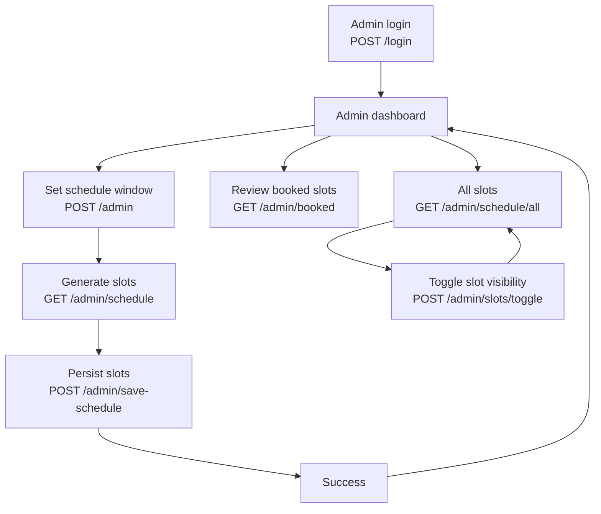

# Admin Flow

Admin capabilities focus on defining working periods, generating slots, monitoring bookings, and moderating slot visibility.

## Steps
- Log in via `/login` with an account that has `ROLE_ADMIN`; `CustomAuthenticationSuccessHandler` redirects to `/admin/dashboard` after issuing JWT cookies.
- Create schedule window on `/admin` (start/end dates). `ScheduleService` rejects overlaps.
- Generate timeslots on `/admin/schedule` by selecting hours per day; submit to `/admin/save-schedule` to persist `Slot` rows as `AVAILABLE`.
- Review booked slots on `/admin/booked` (filtered to `RESERVED`).
- View all slots on `/admin/schedule/all` and toggle visibility on `/admin/slots/manage` → POST `/admin/slots/toggle/{id}` (switches between `AVAILABLE` and `HIDDEN`).
- Use `/success` as the post-creation confirmation screen.

## Diagram

