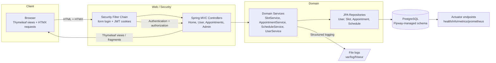
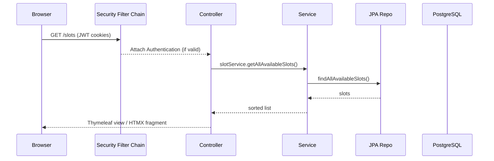

# FrisÖr Architecture

## Overview
FrisÖr is a server-rendered Spring Boot 3.5 application that lets users book and manage hair salon appointments. It uses Thymeleaf + HTMX for lightweight interactivity, stateless JWT-based authentication, and a layered domain/service/repository structure backed by PostgreSQL and Flyway migrations.

## High-Level Architecture

### Request / Auth Lifecycle

## Key Components and Communication
- **Controllers** (`HomeController`, `UserController`, `UserAppointmentController`, `ScheduleController`) handle HTTP endpoints, prepare view models, and delegate business rules to services.
- **Services** encapsulate domain logic:
  - `SlotService` fetches/locks slots and creates `Appointment` objects.
  - `AppointmentService` enforces ownership and status rules for cancellations.
  - `ScheduleService` builds daily/hourly ranges and persists working slots.
  - `UserService` handles registration and password hashing.
- **Repositories** (Spring Data JPA) isolate persistence and map to `User`, `Appointment`, `Slot`, and `Schedule` entities.
- **Security**:
  - Stateless sessions (`SessionCreationPolicy.STATELESS`) with JWT access + refresh tokens stored as HttpOnly cookies.
  - `JwtAuthenticationFilter` extracts/validates tokens on each request and re-issues tokens on valid refresh.
  - `CustomAuthenticationSuccessHandler` issues tokens after form login and redirects admins to `/admin/dashboard`.
- **Views** use Thymeleaf and HTMX fragments for partial updates (e.g., booking/cancel flows) without a full SPA.
- **Data**: PostgreSQL schema versioned by Flyway (`src/main/resources/db/migration`), covering users, roles, schedules, slots, and appointments.
- **Operations**: Actuator exposes health/metrics/prometheus; logs are written to `/var/log/friseur/application.log` by default (ensure writable in containers).

## Design Decisions and Rationale
- **Stateless JWT + cookies**: Keeps browser interactions simple (form login + HTMX) while supporting future API clients without server sessions.
- **Layered services/repositories**: Keeps controllers thin, centralizes validation (ownership checks, slot state transitions), and eases unit testing.
- **HTMX + Thymeleaf**: Minimizes frontend complexity while enabling dynamic fragments for booking and dashboard updates.
- **Flyway migrations**: Guarantees schema parity across environments and containers; runs automatically on startup.
- **BCrypt passwords**: Spring Security `BCryptPasswordEncoder` is used for secure credential storage.
- **Actuator exposure**: Health/metrics are exposed for container orchestration and monitoring; `prometheus` is enabled for scraping.

## Data Model (summary)
- `app_user`: email/password/phone/username with `user_roles` join table.
- `appointment`: links a user to a slot with status (`UPCOMING`, `COMPLETED`, `CANCELLED`).
- `slot`: timeslot with `SlotStatus` (`AVAILABLE`, `RESERVED`, `PAID`, `CANCELLED`, `CLOSED`, `HIDDEN`) and optional appointment link.
- `schedule`: working day ranges from which slots are generated.

## Cross-Cutting Concerns
- **Internationalization** via message bundles (`messages_*.properties`).
- **Logging**: SLF4J at INFO/DEBUG with per-class loggers; failure handler logs login failures.
- **Validation**: Jakarta Validation annotations on entities/config (`JwtProperties`) and manual checks in services.
- **Configuration**: Externalized via environment variables for DB, ports, and JWT secrets (`spring-dotenv` supported for local `.env` files).
