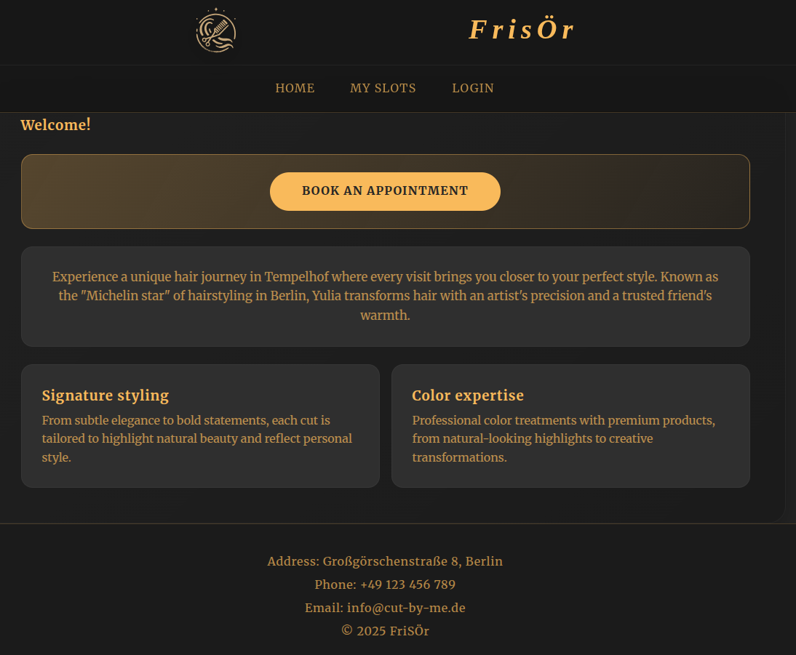
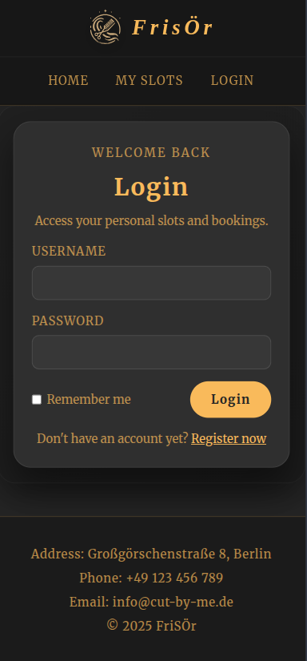
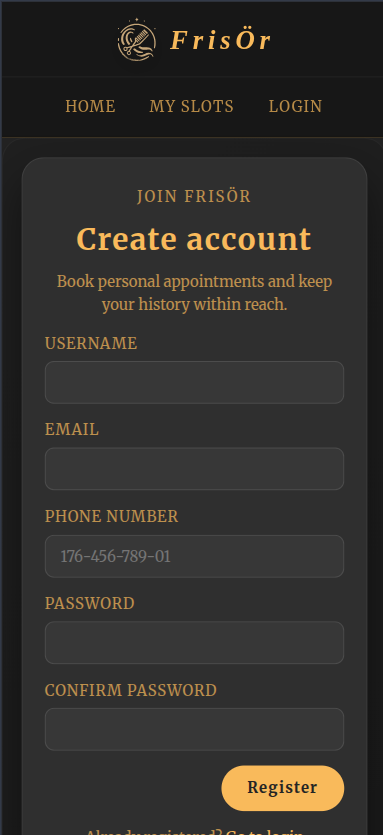
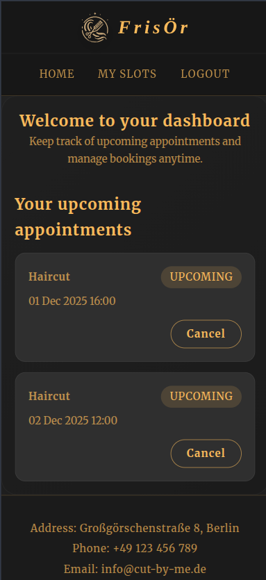
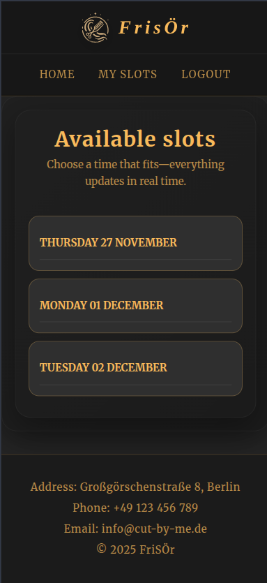
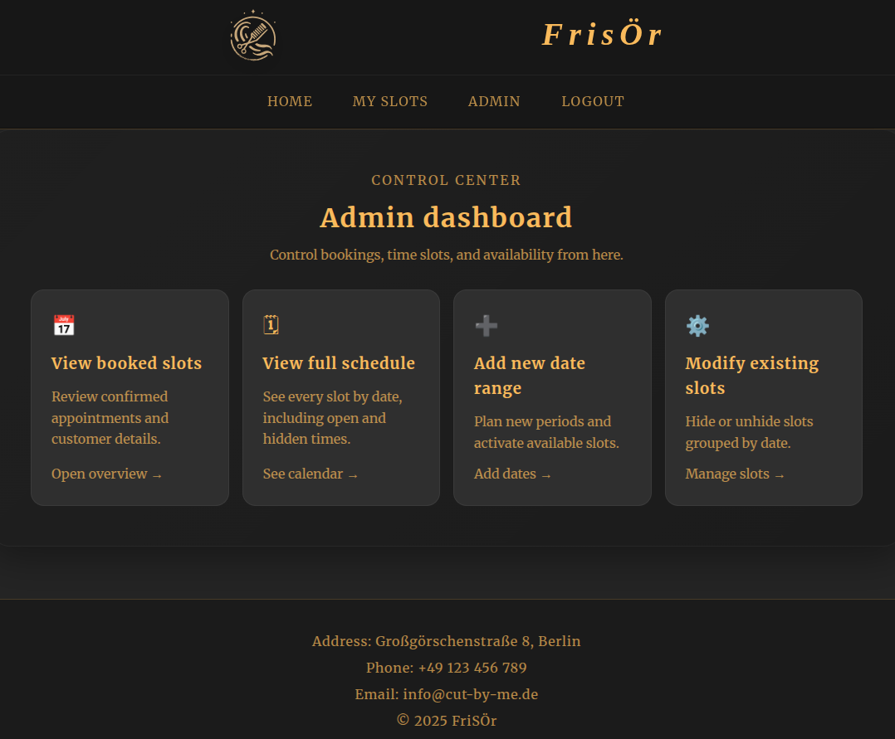

# FrisÖr - Hair Salon Appointment Booker

This is a web application for a hairdressing salon in Berlin Tempelhof that allows users to book and manage their appointments.

## Features

*   **User Authentication:** Users can register and log in to their accounts.
*   **Appointment Booking:** Users can view available time slots and book appointments.
*   **Appointment Management:** Users can view their upcoming appointments and cancel them.
*   **Admin Dashboard:** Admins have a separate dashboard to manage the salon's operations.
*   **Schedule Management:** Admins can create and manage the weekly schedule and available slots.
*   **User Management:** Admins can view and manage all registered users.

## Screenshots (desktop & mobile)

| Home Page | Login Page |
| :---: | :---: |
|  |  |

| Register Page | User Dashboard |
| :---: | :---: |
|  |  |

| Book Appointment | Admin Dashboard |
| :---: | :---: |
|  |  |


## Technology Stack

*   **Backend:**
    *   Java 25
    *   Spring Boot 3.5.0
    *   Spring Security
    *   Spring Data JPA
*   **Frontend:**
    *   Thymeleaf
    *   HTMX
    *   CSS
    *   JavaScript
*   **Database:**
    *   PostgreSQL
*   **Build Tool:**
    *   Maven

## Documentation

- Architecture & rationale: [ARCHITECTURE.md](ARCHITECTURE.md)
- User journey: [USER_FLOW.md](USER_FLOW.md)
- Admin journey: [ADMIN_FLOW.md](ADMIN_FLOW.md)
- Setup & local/Docker runbook: [SETUP.md](SETUP.md)
- Deployment & operations: [DEPLOYMENT.md](DEPLOYMENT.md)

## Getting Started

For a full walkthrough (env vars, Docker, migrations, test data), see [SETUP.md](SETUP.md).

### Prerequisites

*   Java 25 or higher
*   Maven 3.6.3 or higher
*   PostgreSQL database

### Installation

1.  **Clone the repository:**
    ```bash
    git clone https://github.com/your-username/friseur.git
    cd friseur
    ```

2.  **Configure the database:**
    *   Open `src/main/resources/application.properties`.
    *   Update the `spring.datasource.url`, `spring.datasource.username`, and `spring.datasource.password` properties to match your PostgreSQL configuration.

3.  **Build the project:**
    ```bash
    mvn clean install
    ```

## Usage

1.  **Run the application:**
    ```bash
    mvn spring-boot:run
    ```
2.  The application will be available at `http://localhost:8080`.

## API Endpoints

### Home
*   `GET /`: Displays the homepage.
*   `GET /login`: Displays the login page.
*   `GET /register`: Displays the registration page.
*   `POST /register`: Handles user registration.

### User
*   `GET /user/dashboard`: Displays the user dashboard.
*   `GET /appointments/book`: Displays the appointment booking page.
*   `POST /appointments/book`: Handles the booking of an appointment.
*   `GET /appointments/my-appointments`: Displays the user's appointments.
*   `POST /appointments/cancel/{id}`: Cancels an appointment.

### Admin
*   `GET /admin/dashboard`: Displays the admin dashboard.
*   `GET /admin/schedule/create`: Displays the page for creating a new schedule.
*   `POST /admin/schedule/create`: Handles the creation of a new schedule.
*   `GET /admin/schedule/`: Displays the list of all schedules.
*   `GET /admin/users`: Displays a list of all users.
*   `GET /admin/users/{id}`: Displays the details of a specific user.
*   `POST /admin/users/delete/{id}`: Deletes a user.
