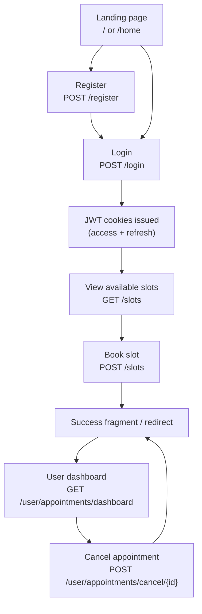

# User Flow

End-to-end flow for a standard user booking and managing appointments.

## Steps
- Land on `/` or `/home` (public).
- Register via `/register` (server validates uniqueness, hashes password with BCrypt).
- Log in via `/login`; on success, JWT access/refresh cookies are issued and the user is redirected to `/home`.
- Browse available dates/slots at `/slots` (HTMX-friendly list filtered to future, available slots).
- Book a slot via POST `/slots` with the selected timestamp; creates an `Appointment`, marks the `Slot` as `RESERVED`, and renders a confirmation fragment.
- View upcoming appointments on `/user/appointments/dashboard` (requires authentication).
- Cancel an appointment via POST `/user/appointments/cancel/{id}` (HTMX swap on success); service enforces ownership and status.

## Diagram

